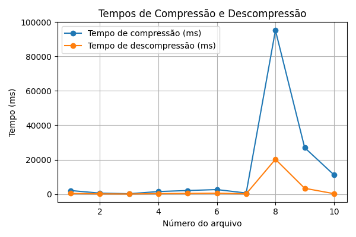
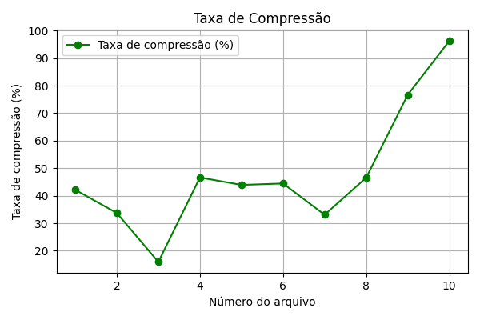

## Introdução

**Grupo:** Philipe e Salvador

**Repositório:** http://github.com/philipedc/lzw

O TP1 de Algoritmos II consiste em criar um algortimo para compressão e descompressão de arquivos usando o LZW. A primeira observação é que o algoritmo aceita uma sequência strings de bits qualquer, logo pode ser usado para qualquer tipo de arquivo.

A Trie (ou Árvore de Prefixos) é uma estrutura de dados eficiente para armazenar strings e realizar operações como inserções, buscas e remoções. Sua principal vantagem é a capacidade de armazenar strings de forma compacta e otimizada, tornando-a ideal para aplicações de prefix matching (como demonstrado em sala de aula) e sistemas de recomendação baseados em prefixos. As operações de inserção, busca e remoção na Trie têm complexidade O(n), onde n é o tamanho da string envolvida, já que é necessário percorrer os caracteres da string na árvore.

## Detalhes de Implementação:

Para otimizar o uso de memória, implementamos uma Trie compacta, ou seja, buscamos armazenar o máximo possível de caracteres em cada nó, evitando a criação de nós desnecessários.

Um dos principais desafios na implementação dessa estrutura foi adaptá-la para apoiar o algoritmo LZW (Lempel-Ziv-Welch). Especificamente, a Trie precisava ser capaz de realizar buscas tanto por chave quanto por valor (isto é, tree[key] = value ou tree[value] = key). Para resolver esse problema, criamos duas árvores: uma armazenando as chaves e outra armazenando os valores invertidos (onde cada valor é a chave na segunda árvore). Isso permite realizar buscas eficientes tanto por chave quanto por valor.

  O algoritmo faz a leitura dos dados do arquivo de entrada como sequências de bytes, em vez de strings de caracteres. Essa característica permite que arquivos não-textuais possam ser processados e comprimidos corretamente como, por exemplo, arquivos de imagem. A sequência de bytes (em hexadecimal) é processada pela função de compressão do algoritmo LZW. Essa função retorna uma lista de inteiros que representam os códigos gerados pelo algoritmo. Em seguida cada elemento dessa lista é convertido para sua representação binária com o comprimento de bits informado como parâmetro opcional no caso da versão que utiliza códigos de tamanho fixo (se não for informado, o comprimento padrão é de 12 bits). Já no caso da versão que utiliza códigos de tamanho variável, o comprimento de bits começa com 9 bits, e é aumentado conforme a necessidade até atingir um número máximo, que também pode ser passado como parâmetro opcional.

  Essa lista de números em binário é convertida em uma única string binária que representa o arquivo comprimido. Essa string é particionada em bytes, que são salvos no arquivo comprimido. Para se realizar a descompressão, todos os passos anteriores são executados em reverso. Primeiro os bytes do arquivo comprimido são lidos e concatenados em uma única string binária. Essa string é particionada em uma lista de números em binário. Em seguida, cada número é convertido para a sua representação em inteiros. Essa lista de inteiros, que representa os códigos gerados na descompressão, é processada pela função de descompressão do algoritmo. A partir disso, a string que representa o conteúdo do arquivo original é recuperada e pode ser salva em um novo arquivo de formato apropriado.

  Essa implementação também gera 4 métricas de desempenho do algoritmo: taxa de compressão, tempo de execução da função de compressão, tempo de execução da função de descompressão e tempo total de execução do algoritmo. Esses dados são utilizados para a realização de testes de desempenho do algoritmo, e que são exploradas em outra parte deste trabalho. Foram escolhidos 7 arquivos de texto simples e 3 arquivos de imagem bitmap para a realização dos testes.

  Quando o dicionário usado pelo algoritmo se torna cheio, a estratégia utilizada para lidar com isso é resetar o dicionário ao seu estado inicial. Essa solução foi escolhida pela a sua simplicidade. Entretanto, fazer isso prejudica a taxa de compressão pois códigos que já foram "aprendidos" pelo algoritmo são apagados e precisam ser adicionados novamente ao dicionário. 

  É importante destacar também como o tamanho do dicionário afeta a performance do algoritmo, a qualidade da compressão e o gasto de memória. Em relação a qualidade da compressão, dicionários maiores podem armazenar mais entradas, o que por sua vez permite que repetições e redundâncias do arquivo de entrada possam ser mais exploradas para comprimir mais o arquivo. Dicionários menores reduzem a qualidade de compressão e geram reinicializações mais frequentes do dicionário. Em relação a consumo de memória, dicionários pequenos tem a vantagem por gastarem menos espaço para armazenar os códigos gerados. Finalmente, em relação a velocidade de compressão/descompressão, dicionários menores também tem a vantagem pois o algoritmo gasta menos tempo fazendo buscas no dicionário. Dessa forma, o tamanho do dicionário escolhido deve levar em consideração esses 3 fatores, buscando um equilíbrio que melhor se aplique a cada caso de uso.

## Modo de Uso

### Cada versão do LZW pode ser testada de forma individual:
**Obrsevação:** Cada execução dos comandos abaixo realiza a compressão do arquivo de entrada, a descompressão e a geração dos arquivos comprimidos e descomprimidos. Em relação ao arquivo descomprimido, o seu nome deve ser passado com a respectiva extensão (Teste1.bmp, por exemplo). Além disso, todos os parâmetros, com exceção do último, são obrigatórios.

**LZW Fixo:** `python3 Main_Fixo.py arquivo_entrada arquivo_comprimido arquivo_descomprimido --tam_dic {tamanho}`

**LZW Variável:** `python3 Main_Variavel.py arquivo_entrada arquivo_comprimido arquivo_descomprimido --tam_max_dic {tamanho}`

### LZW em todos os samples ao mesmo tempo:

Execute `python3 run_all.py` os resultados aparecerão em outputs/

## Benchmark/Testes

A única célula do jupyter **generate_graph.ipynb** utiliza os dados gerados pelo **run_all.py** e gera os dados a seguir:

Os valores 1 à 7 representam arquivos de texto e 8 à 10 são arquivos bmp. É possível notar que em ambos os gráficos o valor do eixo y aumenta consideravelmente para os arquivos bmp. Isso implica que que o algoritmo gasta um tempo consideravelmente maior para comprimir e descomprimir bmp's, mas em contrapartida também consegue uma taxa de compressão bem maior

Além disso, testes foram desenvolvidos para garantir que a Trie funcione corretamente após cada modificação. Os testes podem ser executados com o comando: `python3 test_tree.py`.
